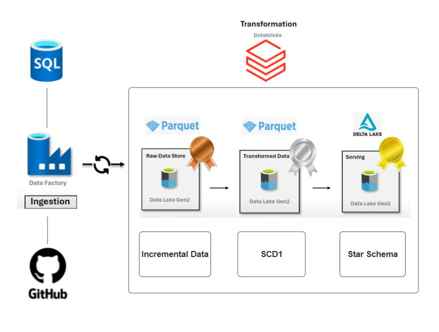
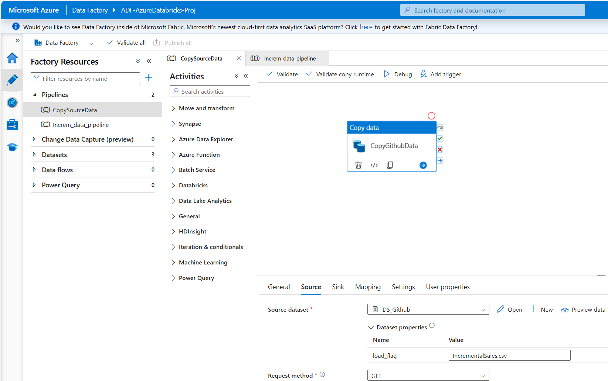
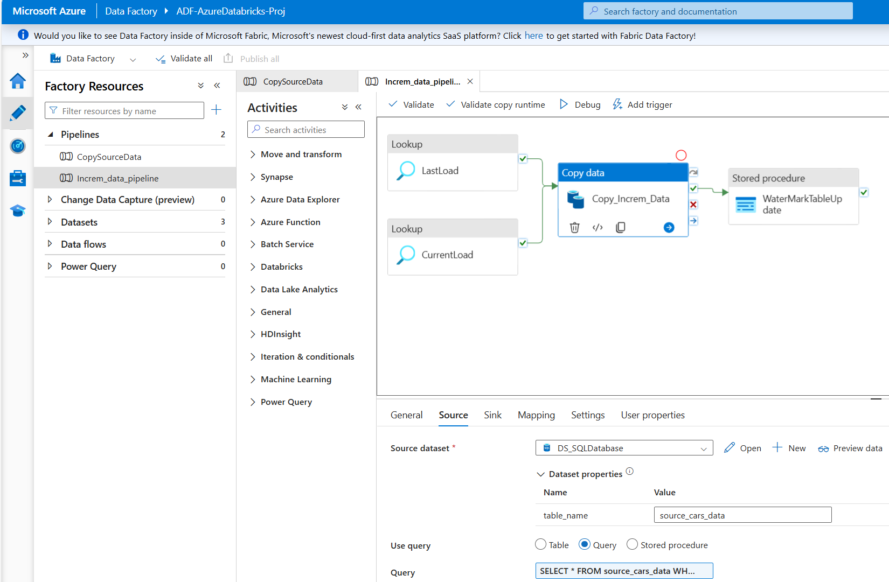
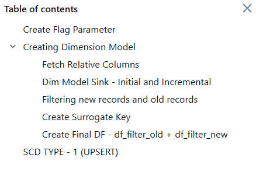
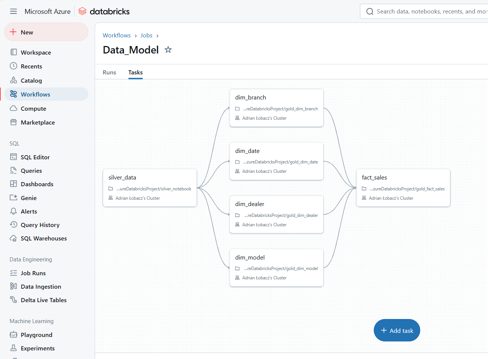

# Star Schema and SCD1 with Azure Data Factory and Databricks

## 📖 Project Overview  

In this project, I used Azure Data Factory (ADF) and Databricks to build a data pipeline that extracts data from GitHub, processes it, and loads it into Azure Data Lake Storage Gen2. I created dimension and fact tables in Databricks, applying SCD Type 1 to manage historical data changes. A SQL Database was also used to store processed data for further analysis. ADF orchestrated the ETL process, while Azure Storage Gen2 provided scalable and secure data storage.

---
## 🏠 Project Architecture

## 📊 Dataset  
The dataset comprises ten CSV files, one for 
- **SalesDate**: Contains information about car sales
- **IncrementalSales**: Includes new data to test incremental load
---

## 🔧 Azure Services Utilized
### 1. Azure Data Factory (ADF)
- Pipeline for copying data from GitHub to Azure SQL Database
- Pipeline for incremental data loading from Azure SQL Database to Azure Data Lake Storage Gen2 (ADLS Gen2)
### 2. Azure Data Lake Storage Gen2 (ADLS Gen2)
- Storage data from all layers: Bronze, Silver, and Gold
### 3. Azure SQL Database
- Storage raw data
- WaterMarkTable for incremental load
### 4. Azure Databricks
- Star schema architecture
- Implementing Slowly Changing Dimensions (SCD1)
---
## 🛠️ Process Description

1. **Data Ingestion**

- **CopySourceData**: Bulk load all sales data from Github repository to `bronze` folder in ADLS Gen2.
- **Increm_data_pipeline**: Pipleline for incremental load new sales data

2. **Data Transformation**  
- **silver_notebook**: Read data from `bronze` folder, transform and write to `silver` table 
- **gold_dim_notebook**: Four notebooks for creating dimensions with SCD Type 1
 
- **gold_fact_notebook**: Creating a fact table and connecting it with dimensions using keys. Writing Fact Table
- **Workflow**: Creating a workflow to run all notebooks and refresh data in the dimensions and fact table

 ## 📌 Project Summary
In this project, I developed an ETL process using Azure Data Factory (ADF) to load data, including incremental data loading. To enable incremental loading, I used an SQL database with a watermark table, which allowed me to track and identify the data that had already been loaded.

Next, I retrieved data from the Bronze layer in Databricks, transformed it, and saved it in the Silver layer. I then created dimensions and procedures to load the data, including two separate statuses for the initial load and subsequent loads. Each dimension was implemented with Slowly Changing Dimension (SCD) Type 1 logic.

Afterward, I created a fact table and connected it to the dimensions using keys, then loaded the data into the fact table. 

Finally, I built a workflow that integrates all previous steps, refreshing the Silver layer and reloading the dimensions and fact table.
 
in proggres
---
## 👤 Author
- **Name**: Adrian Łobacz
- **Contact**: adrianlobacz.1998@wp.pl
- **LinkedIn**: https://www.linkedin.com/in/adrian-%C5%82obacz-37b66a206/
  
Feel free to contact with me!
